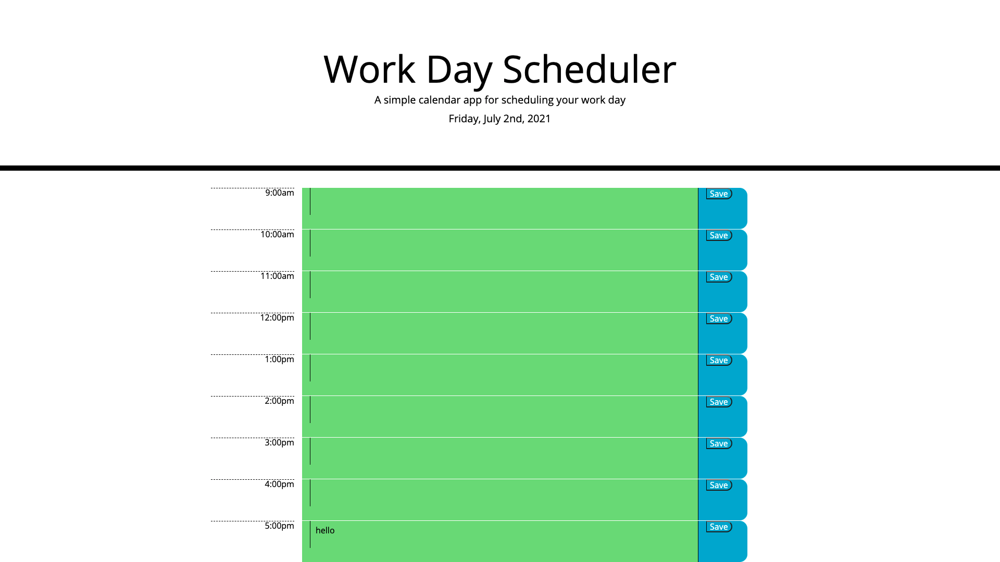

# Work Day Scheduler

The purpose of this project was to create a simple planner that a user could use for the working hours of the day. They would be able to put in the tasks/events and save it to the planner. If this page was refreshed, the data should be stored and still apear on the page.

The Work Day Scheduler:

Technologies used:
- 
